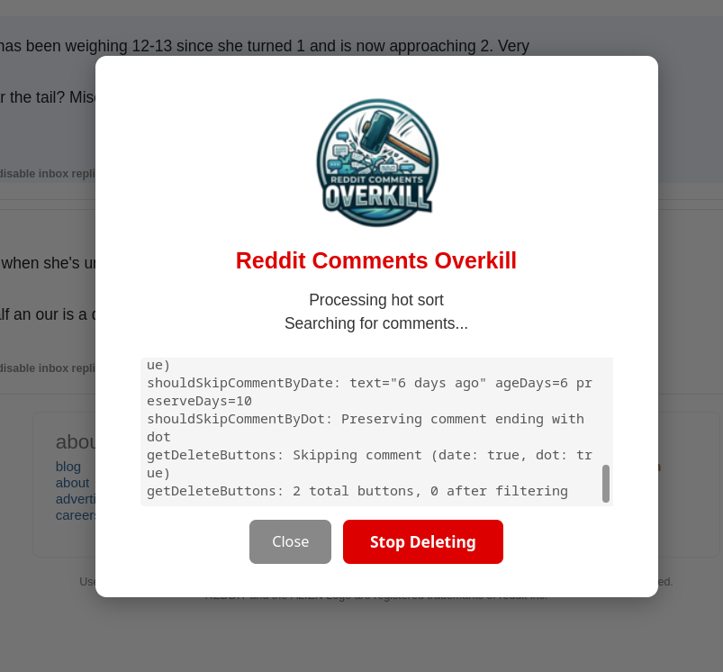

# Reddit Comments Overkill

  

  

A browser userscript that automatically deletes all your Reddit comments. It's designed to be reliable and respect Reddit's rate limits while ensuring complete coverage of your comment history. Reddit has a lot of protections in place to throttle requests. This script does NOT try to be the fastest but instead tries to ensure ALL comments will eventually be gone without requiring user interaction.

## Why

Reddit has recently stopped issuing app tokens for users, further restricting direct API use. This means existing scripts, apps, and browser extensions that rely on the API are no longer likely to work. This script uses **web scraping** from your own browser to delete comments. No API tokens needed.

  

## Features

- **Complete Coverage**: Cycles through all 4 sort types (`new`, `hot`, `top`, `controversial`) to find every comment. However due to the way Reddit caches comments, you may have to run the script again after some hours.

- **Date Protection**: By default, comments from the last 10 days are preserved. Configurable in the confirmation modal.
- **Dot Preservation**: If you want to keep a particular comment no matter what, just edit that comment and add a single dot (`.`) on its own line at the end. The script will detect this and skip it regardless of age. Toggle this feature in the confirmation modal. (Default: enabled)
- **X Means Delete**: If you want to force-delete a particular comment regardless of its age, just edit that comment and add a single `x` on its own line at the end. This overrides the date filter and will delete even 1-day-old comments. Toggle in the confirmation modal. (Default: disabled)
- **Dry-Run Mode**: Log actions without actually deleting comments. Useful for testing dot/x detection and previewing deletions. Toggle in the confirmation modal.
- **Non-feature**: This script does **not** edit your comments with garbage text before deleting them, unlike some other solutions. It deletes them cleanly in their original state.
- **Rate Limit Handling**:
    - Automatically detects rate limits (429 errors) from both `fetch` and `XMLHttpRequest`.
    - Implements exponential backoff, doubling the wait time after each rate limit detection (e.g., 60s, 120s, 240s) up to a maximum of 30 minutes.
- **Detailed Logging**: All actions, including deletions, sort changes, and rate limit warnings, are logged to the browser's developer console (F12).

## Installation

### Step-by-Step Guide

1. **Install a userscript manager** (if you don't have one):
   - **Primary recommendation**: [Violentmonkey](https://violentmonkey.github.io/) (tested and confirmed working)
   - Alternative options:
     - [Tampermonkey](https://www.tampermonkey.net/) (Chrome/Firefox/Edge)
     - [Greasemonkey](https://www.greasespot.net/) (Firefox only)

2. **Install the script**:
   - Click on the `reddit-comments-overkill.user.js` file in this repository
   - Click the "Raw" button to view the raw script
   - Your userscript manager should prompt you to install it — if it doesn't, copy the entire script content (Ctrl+A, Ctrl+C), open your userscript manager's dashboard, create a new script, paste, and save (Ctrl+S)

3. **Verify installation**:
   - Go to your Reddit user comments page on old Reddit (see Usage below)
   - You should see a "Reddit Comments Overkill" button in the bottom-right corner

## Usage

1. Navigate to your Reddit user comments page on **old Reddit** (the new Reddit UI is not supported):
   - <code>https://old.reddit.com/user/<em>yourusername</em>/comments/</code>

Direct install link: <code>https://github.com/xpufx/reddit-comments-overkill/raw/refs/heads/main/reddit-comments-overkill.user.js</code>

2. Click the **"Start Deleting"** button in the bottom-right corner

3. A confirmation modal will appear where you can configure:
   - **Days to preserve** (default: 10)
   - **Dot preservation** toggle (default: enabled)
   - **X means delete** toggle (default: disabled)
   - **Dry-run mode** toggle (default: disabled)
   
4. The script will:
   - Begin deleting comments starting from the current page's sort
   - Process all 4 sort types automatically (new → hot → top → controversial)
   - Show progress in browser console
   - Handle rate limits and pagination automatically
   - Preserve recent comments and dot-marked comments based on your settings
   - Force-delete x-marked comments if enabled

5. To stop the process, click **"Stop Deleting"** (button turns red when running)

## Configuration

Most settings can be configured in the confirmation modal when you click "Start Deleting":

- **Days to preserve**: Number input (0–365) to set how many days of recent comments to keep
- **Dot preservation**: Checkbox to preserve comments ending with a single `.` on its own line
- **X means delete**: Checkbox to force-delete comments ending with a single `x` on its own line, overriding the date filter
- **Dry-run mode**: Checkbox to log actions without actually deleting

For advanced configuration (rate limits, delays, sort order), edit the `CONFIG` section at the top of the script file.

## Troubleshooting

### Script not starting
- Ensure you're on your old Reddit user comments page (URL should contain <code>old.reddit.com/user/<em>yourusername</em>/comments/</code>)
- Check that your userscript manager is enabled and the script is active
- Look for the "Reddit Comments Overkill" button in the bottom-right corner
- Open browser console (F12) to see if the script is loading

### Comments not being deleted
- Check if comments are newer than your configured preserve days (they're preserved by default)
- Check if comments end with a dot on its own line (dot preservation is enabled by default)
- Check if comments ending with x on their own line are being force-deleted (x-means-delete is disabled by default)
- Open browser console (F12) to see script activity and error messages
- Check if rate limiting is active (script will wait automatically)

### Contributing
1. Not at this time

## AI Authorship Disclosure

Please note that a significant portion of this codebase, including its core logic and structure, has been generated by an AI. The functionality has been manually tested using Violentmonkey.

## License

This project is licensed under the GNU General Public License v2.0 (GPL v2).

Copyright (C) 2025 xpufx 

## Disclaimer

This script modifies your Reddit account by permanently deleting comments. Use at your own risk. The authors are not responsible for any data loss or account issues. Always consider the implications of bulk deleting your comment history.
